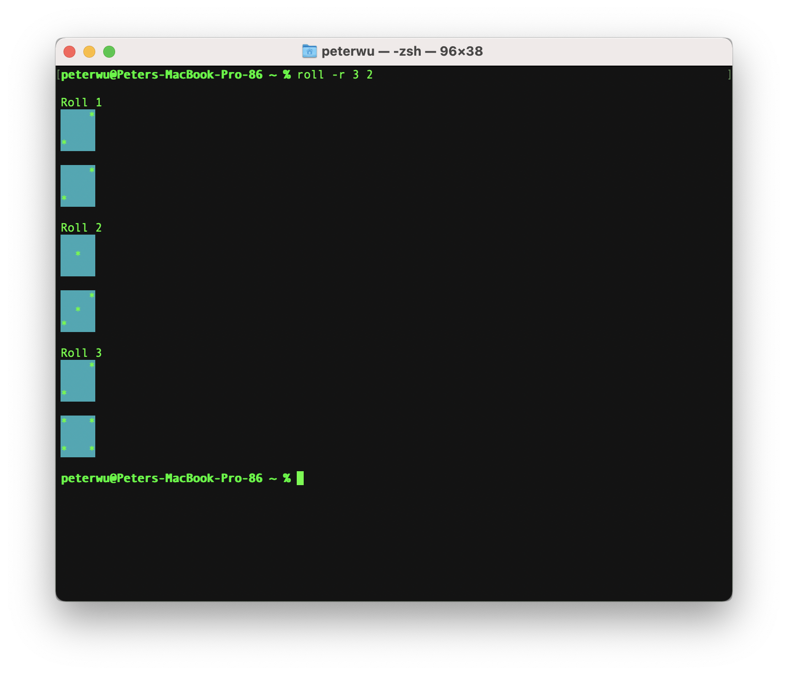
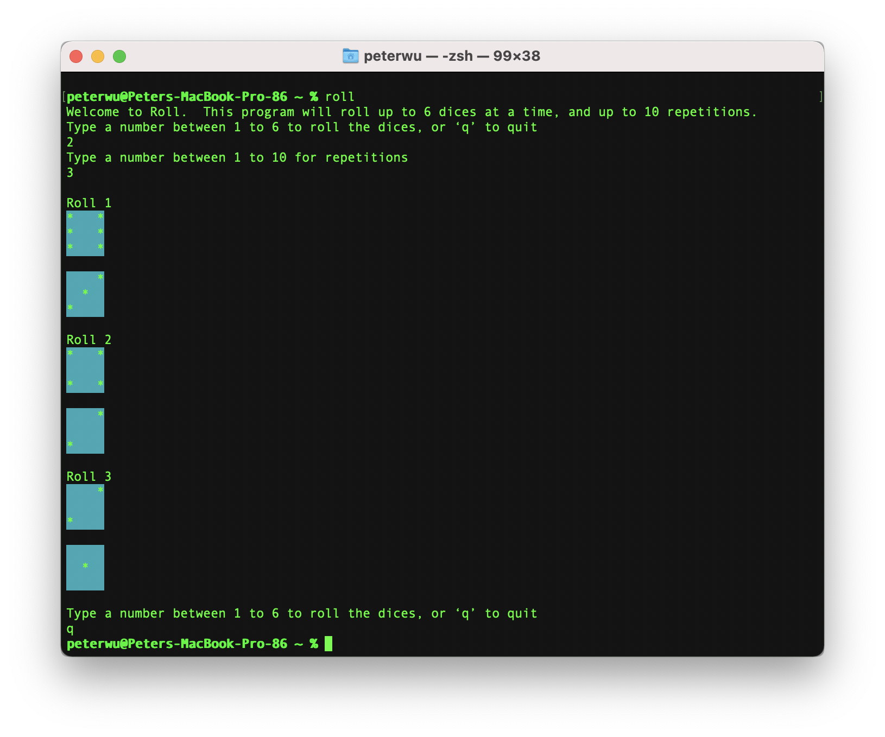

#  Roll

A simple Command Line App that roll dices and display the results in console

### Installation
You may download the first release [here](https://github.com/PPeter326/Roll/releases/tag/1.0.0).  Follow the installation instruction to install the app.  Once installed, you can find Roll in the Application folder.  

Commandline invocation coming soon. 

### Usage

You can quickly roll a few dices by entering a number from 1 to 6 after the command.

Example: ```roll 2``` will roll two dices, and the roll results will be printed to the console


### Options

* **Repeat**
You can repeat the rolls up to 10 times.  Type ```-r``` followed by a number between 1 to 10 to repeat the rolls.  ```-r``` without an argument will default to 2 repetitions.  




* **Help**
Type ```-h``` for quick reference to usage


### Interactive Mode
Type ```roll```  with no options and arguments will take you to interactive mode, where you will be prompted to enter the number of dices and repetitions.  After displaying roll results, ther interactive mode continues until you type ```q``` to quit the program. 



## License

This project is licensed under the MIT License - see the [LICENSE](LICENSE) file for details

