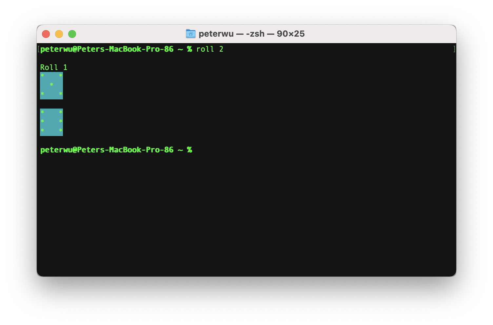
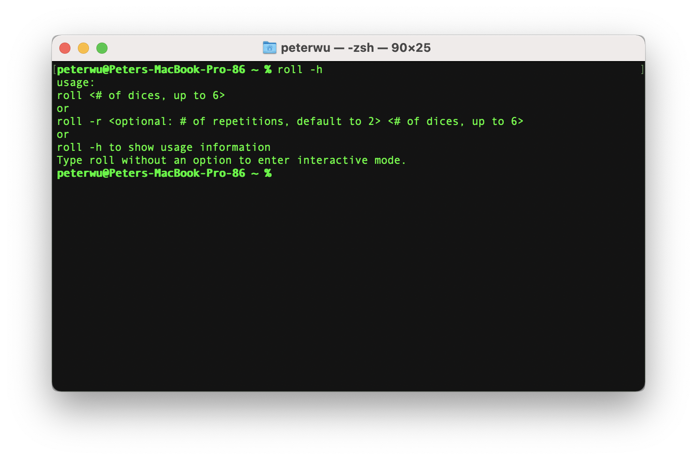

#  Roll

A simple Command Line App that roll dice and display the results in console

### Installation
You may download the first release [here](https://github.com/PPeter326/Roll/releases/tag/1.0.0).  Follow the installation instruction to install the app.  Once installed, you can find the Roll executable in the Application folder.  

In addition, the package will also execute a post install script which will create an alias that point to Roll in the Application folder.  You may find the alias in the .zshenv file in your home directory, as shown below:
    
```
alias roll="/Applications/Roll"
```
This will allow you to run **Roll** just by typing ```roll``` inside your terminal.


### Usage

You can quickly roll a few dice by entering a number from 1 to 6 after the command.

Example: ```roll 2``` will roll two dice, and the roll results will be printed to the console



### Options

* **Repeat**
You can repeat the rolls up to 10 times.  Type ```-r``` followed by a number between 1 to 10 to repeat the rolls.  ```-r``` without an argument will default to 2 repetitions.  


* **Help**
Type ```-h``` for quick reference to usage



### Interactive Mode
Type ```roll```  with no options and arguments will take you to interactive mode, where you will be prompted to enter the number of dices and repetitions.  After displaying roll results, ther interactive mode continues until you type ```q``` to quit the program. 


## License

This project is licensed under the MIT License - see the [LICENSE](LICENSE) file for details

## Acknowledgement

This is my first command line app, and I took inspiration and materials from several tutorials and projects, the most notable ones being: 

* [PercentageIncrease](https://github.com/AlexPerathoner/PercentageIncrease) from @AlexPerathoner
* Ray Wenderlich's [Command Line Programs on macOS](https://www.raywenderlich.com/511-command-line-programs-on-macos-tutorial) Tutorial by Eric Soto
